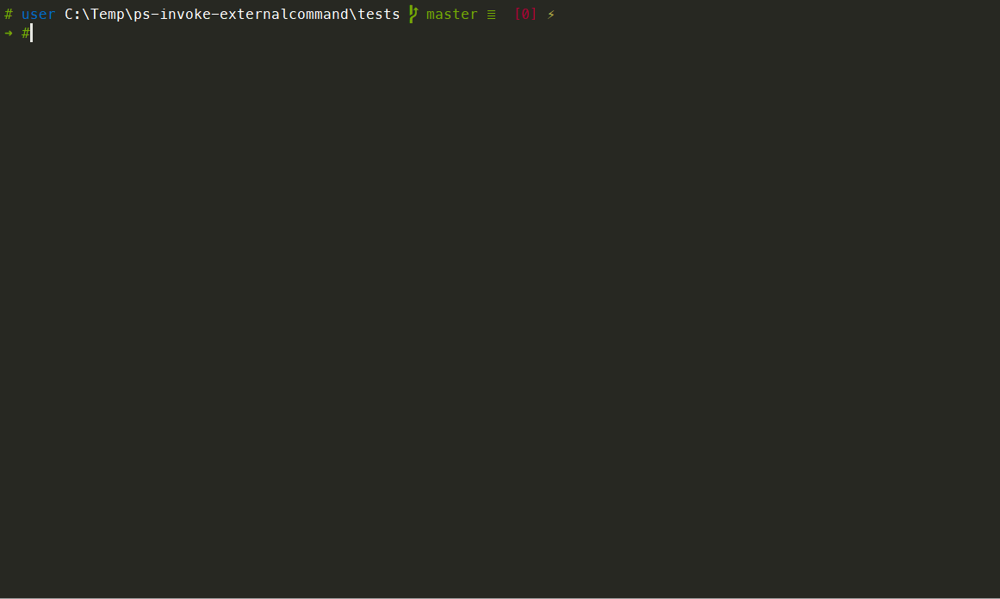

# ExternalCommand Powershell Module

## Description

Module contains Cmdlet `Invoke-ExternalCommand` that executes system's native commandline applications

## Problem 

This module was created due to multiple issues in PowerShell related to escaping of arguments for external processes. Even when using powershell call operator `&` with stop-parsing symbol `--%`  windows will interpolate environmental variable like `%OS%` into application arguments.

## Features

- Cross platform, runs in Windows PowerShell 5.1 and PowerShell Core 6+ on Linux/Mac
- Escapes all argument values correctly without PowerShell or system interpolation
- Displays STDOUT/STDERR output while it runs
- By default throws exception if application process exits with non 0 exit code
- Allows capturing of STDOUT, STDERR, STDOUT combined with STDERR and exit code into PowerShell variables
- Allows to hide STDERR, STDOUT or sensitive arguments from host output if required

**Nuances**

- STDERR output sequence is not guaranteed, as its captured via event

## Demo



## Install

Available in PSGallery: [https://www.powershellgallery.com/packages/ExternalCommand](https://www.powershellgallery.com/packages/ExternalCommand)

```pwsh
Install-Module -Name ExternalCommand
```

## Usage

```pwsh
$ Get-Help Invoke-ExternalCommand -Full
NAME
    Invoke-ExternalCommand

SYNOPSIS
    This is a helper function that runs a external executable binary and checks
    exit code for success to see if an error occurred. If an non 0 exit code is
    detected then an exception is thrown by default. It also properly creates
    and escapes arguments supplied via Arguments array parameter. Supports UTF8
    and whitespace in the argument values.


SYNTAX
    Invoke-ExternalCommand [-Command] <String> [[-Arguments] <String[]>] [[-HideArguments]
    <Int32[]>] [[-DontEscapeArguments] <Int32[]>] [[-OutVarStdout] <String>]
    [[-OutVarStderr] <String>] [[-OutVarCode] <String>] [-Return] [-IgnoreExitCode]
    [-HideStdout] [-HideStderr] [-HideCommand] [<CommonParameters>]


DESCRIPTION


PARAMETERS
    -Command <String>
        Executable name/command to run. Must be available at PATH env var or you can specify
        full path to the binary.

        Required?                    true
        Position?                    1
        Default value
        Accept pipeline input?       false
        Accept wildcard characters?  false

    -Arguments <String[]>
        Arguments string array to path to Command as arguments

        Required?                    false
        Position?                    2
        Default value                @()
        Accept pipeline input?       false
        Accept wildcard characters?  false

    -HideArguments <Int32[]>
        List indexes (starting with 0) of arguments you would like to obscure in the message
        that command and its
        arguments that being executed.

        Required?                    false
        Position?                    3
        Default value                @()
        Accept pipeline input?       false
        Accept wildcard characters?  false

    -DontEscapeArguments <Int32[]>
        List indexes (starting with 0) of arguments you would like to skip escape logic on.
        When used, unless is a simple argument it's on you to escape it correctly

        Required?                    false
        Position?                    4
        Default value                @()
        Accept pipeline input?       false
        Accept wildcard characters?  false

    -OutVarStdout <String>
        Provide variable name that will be used to save STDOUT output of the command
        execution.

        Required?                    false
        Position?                    5
        Default value
        Accept pipeline input?       false
        Accept wildcard characters?  false

    -OutVarStderr <String>
        Provide variable name that will be used to save STDERR output of the command
        execution.

        Required?                    false
        Position?                    6
        Default value
        Accept pipeline input?       false
        Accept wildcard characters?  false

    -OutVarCode <String>
        Provide variable name that will be used to save process exit code.

        Required?                    false
        Position?                    7
        Default value
        Accept pipeline input?       false
        Accept wildcard characters?  false

    -Return [<SwitchParameter>]
        By default this function returns $null, if specified you will get this object:
        @{Stdout="Contains Stdout",Stderr="Contains Stderr",All="Stdout and Stderr output as
        it was generated",Code="Int from process exit code"}
        Stdout output sequence order is guaranteed, while Stderr lines sequence might be out
        of order (eventing nature?).

        Required?                    false
        Position?                    named
        Default value                False
        Accept pipeline input?       false
        Accept wildcard characters?  false

    -IgnoreExitCode [<SwitchParameter>]
        Specify if you expect non 0 exit code from the Command and would like to avoid non 0
        exit code exception.

        Required?                    false
        Position?                    named
        Default value                False
        Accept pipeline input?       false
        Accept wildcard characters?  false

    -HideStdout [<SwitchParameter>]
        Specify if don't want STDOUT to be written to the host

        Required?                    false
        Position?                    named
        Default value                False
        Accept pipeline input?       false
        Accept wildcard characters?  false

    -HideStderr [<SwitchParameter>]
        Specify if don't want STDERR to be written to the host

        Required?                    false
        Position?                    named
        Default value                False
        Accept pipeline input?       false
        Accept wildcard characters?  false

    -HideCommand [<SwitchParameter>]
        Specify if don't want `Running command` informational message to be written to the
        host STDERR

        Required?                    false
        Position?                    named
        Default value                False
        Accept pipeline input?       false
        Accept wildcard characters?  false

    <CommonParameters>
        This cmdlet supports the common parameters: Verbose, Debug,
        ErrorAction, ErrorVariable, WarningAction, WarningVariable,
        OutBuffer, PipelineVariable, and OutVariable. For more information, see
        about_CommonParameters (https:/go.microsoft.com/fwlink/?LinkID=113216).

INPUTS

OUTPUTS
    System.Collections.Hashtable


    -------------------------- EXAMPLE 1 --------------------------

    >Invoke-ExternalCommand -Command git -Arguments version

    Running command [ C:\Program Files\Git\cmd\git.exe ] with arguments: "version"
    git version 2.20.1.windows.1

    > Invoke-ExternalCommand -Command helm -Arguments version,--client
    Running command [ C:\ProgramData\chocolatey\bin\helm.exe ] with arguments: "version"
    "--client"
    Client: &version.Version{SemVer:"v2.12.2",
    GitCommit:"7d2b0c73d734f6586ed222a567c5d103fed435be", GitTreeState:"clean"}

    > Invoke-ExternalCommand -Command helm -Arguments versiondd,--client
    Running command [ C:\ProgramData\chocolatey\bin\helm.exe ] with arguments: "versiondd"
    "--client"
    Error: unknown command "versiondd" for "helm"
    Did you mean this?


        version
    Run 'helm --help' for usage.

    Command returned non zero exit code of '1'. Command: helm
    At C:\Users\user\dev\ps-modules\Igloo.Powershell.ExternalCommand\Igloo.Powershell.Externa
    lCommand.psm1:237 char:9
    +         throw ([string]::Format("Command returned non zero exit code  ...
    +         ~~~~~~~~~~~~~~~~~~~~~~~~~~~~~~~~~~~~~~~~~~~~~~~~~~~~~~~~~~~~~
    + CategoryInfo          : OperationStopped: (Command returne.... Command: helm:String)
    [], RuntimeException
    + FullyQualifiedErrorId : Command returned non zero exit code of '1'. Command: helm


RELATED LINKS
```